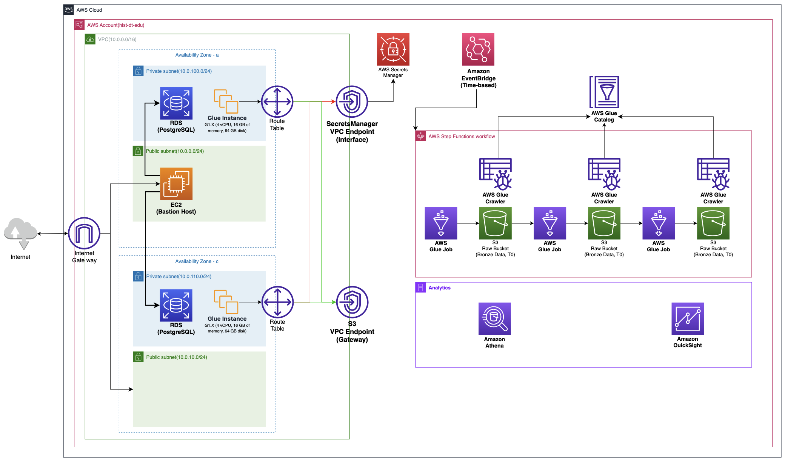

# [2023 역량강화] 배치  데이터 파이프라인 오프라인 강의

## Tips
> 1. 코드의 경우 마우스 오버를 하게 되면 `복사` 버튼을 통해 쉽게 복사 가능.
> 2. AWS CloudFormation 으로 구축된 부분을 메뉴얼로 구축하는 방법을 알고 싶은 경우 [[2022]BATCH Data Pipeline Workshop_Offline 강의] - (github link 예정) 에서 학습 가능.
> - VPC, RDS 등등


# 1. 목적
💡 On-premise 에 있는 OLTP 데이터를 AWS 서비스를 활용하여 어떻게 ETL 작업을 수행하는지, AWS 서비스를 이용하여 파이프라인을 구성하는 방법과 Analytics 서비스 사용 방법에 대해서 학습한다.


## 1.1 강의의 목적

- `Data Engineering 역량강화 인원`에 대해 온라인 강의 수강 후 실제 데이터를 활용하여 전반적인 Data Engineering에 대한 복습과 함께 DB에 적재되어있는 많은 양의 데이터를 추출하여 간단한 Data Lake를 구성하고 해당 데이터를 변환 과정을 통해 사용자가 원하는 형태로 서비스를 제공하는 것을 간략하게 경험해보는 것.

## 1.2 해당 `Hands-on` Pipeline의 목적 및 주제

- XX 그룹에는 4개의 계열사가 존재한다고 가정, 각 계열사 별로 거래 데이터를 기반으로 고객, 상품 데이터와 함께 각 계열사별 매출 확인 및 매출 증대를 위한 전략 수립의 목적으로 데이터 플랫폼을 구축하고자 한다.

## 1.3 강의 기준

- AWS 서비스를 전혀 사용해보지 못한 사용자를 기준으로 설명.

# 2. AWS DATA 아키텍처 및 사전 준비 
> Cloudformation 을 이용하여 기반 인프라는 구성할 예정이며, 해당 교육에서는 AWS Glue 부터 수행하여 Data Orchestration 을 수행하는 AWS Stepfunction 까지 구성할 예정.

AWS 환경에서의 Data 아키텍처를 확인하고 어떤 흐름으로 파이프라인이 흘러가는지 확인 후 실습 진행 예정, 그리고 실습 사전 인프라에 대해서 설명한다. 

## 2.1 Architecture



## 2.2 CloudFormation

💡 AWS Cloudformation 을 이용하여 기본 개발 환경이 만들어지도록 만들어 놨습니다.
이번 교육에서는 공용으로 사용할 데이터베이스와 관련 인프라 환경을 만들어 놓았으며, 이번 교육에서는 따로 작업할 필요 없으며, 추후 개별적으로 집에서나 새롭게 작업을 해보고 싶으신 분들께서는 위 파일을 다운로드 받아 [AWS Cloudformation](https://ap-northeast-2.console.aws.amazon.com/cloudformation/home?region=ap-northeast-2#/) 으로 환경을 구축하시기 바랍니다.

YAML : [`basic_architecture_cloudformation.yaml`](img/basic_architecture_cloudformation.yaml)

- Cloudformation Console → Stack(스택) → 스택생성(새 리소스 사용) → 탬플릿 파일 업로드 → 위에서 다운로드한 파일 업로드
- 위 내용을 실행 후 AWS Lambda 로 이동하여 생성된 Lambda Function 을 수행 → S3 Bucket 및 폴더 생성
- `CloudFormation 환경`
    
    
    

## 2.3 VPC
💡 [VPC, EndPoint, Security Group란?](https://www.notion.so/VPC-EndPoint-Security-Group-c5539bd8b3cb4749949cb035bf96134c?pvs=21)

### 2.3.1 VPC 구성

- VPC : 10.0.0.0/16

### 2.3.2 Subnet 구성

- 각 2개씩 Private, Public Subnet 구성
- Public Subnet(선택) - 아래 항목은 Default 설정, 변경 가능
    - 10.0.0.0/24
    - 10.0.10.0/24
- Private Subnet(선택) - 아래 항목은 Default 설정, 변경 가능
    - 10.0.100.0/24
    - 10.0.110.0/24

### 2.3.3 Endpoint

1. S3 Endpoint
    1. Private Subnet에서 S3로 접근하기 위해서 만든 Endpoint
2. SecretsManager Endpoint
    1. Private Subnet에서 AWS SecretsManager내 리소스 접근을 위해 만든 Endpoint
    2. `PrivateDnsEnabled` 속성 : True

## 2.4 보안그룹(Security Group)

### 2.4.1 Public Security Group

1. Outbound : 모든 TCP → 0.0.0.0/0 (IGW) 통신 
2. Inbound 
    1. TCP(22-SSH) : 사내 IP 허용
        1. 사내에서만 접근이 가능하도록 처리

### 2.4.2 Private Security Group

1. Outbound
    1. 모든 TCP : 0~65535, Private Security Group으로 Destination으로 설정
    2. 443 : s3-prefix-id-list ( VPC 관리형 접두사 목록 내 S3 항목 )
        1. pl-78a54011
2. Inbound
    1. TCP(5432-PostgreSQL) : Public Security Group ID
        1. Public SG을 사용하는 서비스만 접근 가능(Bastion Host역할)
    2. ALL TCP(0-65535) 
        1. 같은 보안그룹 사용, 내부 통신이 가능하도록 허용
        2. AWS Glue Job 을 수행하게 되면 여러 인스턴스를 생성하게 되는데 해당 인스턴스끼리 통신이 가능해야함

## 2.5 RDS

- PostgreSQL
- DB Class
    - db.t3.large
- 용량(선택) : 5~1TB
    - 50GB
- DB 이름(선택)
    - DEEnhancement
- 사용자명(선택)
    - postgres
- 비밀번호
    - AWS SecretsManager 에서 자동생성된 PW(해당 서비스에서 복사하여 Local DBMS에서 사용가능)

## 2.6 EC2(BastionHost)

- RDS 로 접근하기 위한 Public Subnet 에 위치한 EC2(실습에서 사용하지 않음)
- 구성 후 데이터 적재 작업에 사용

## 2.7 AWS SecretsManager(+ VPC Endpoint)
> 💡 AWS Cloudformation 으로 자동 생성되므로 아래 항목은 참고로 확인

AWS내에서 암호의 수명 주기와 해당 정보를 외부에 노출 시키지 않도록 관리해주는 서비스

[2.5 RDS](https://www.notion.so/2-5-RDS-dd13d84fdee94ec7a56451617a5cc8d1?pvs=21)  에서 생성한 Endpoint와 사용자명, 비밀번호를 관리 

AWS Glue 에서 ETL 작업시 SecretsManager 를 호출하여 접속 정보를 조합하여 진행 예정

### 2.7.1 SecretsManager 생성

> RDS 자격 증명 정보를 AWS 에서 관리하기 위한 서비스

1. 현재 구동중인 RDS 선택
2. 이름 : de_enhancement_rds_sm
3. 자동 교체 구성 : False


1. 자동 교체 구성의 경우 아래와 같이 스케줄과 함께 교체 함수를 생성하게 되면 특정 기준으로 암호가 교체가 된다.


### 2.7.2 암호 사용법

```python
# Use this code snippet in your app.
# If you need more information about configurations
# or implementing the sample code, visit the AWS docs:
# https://aws.amazon.com/developer/language/python/

import boto3
from botocore.exceptions import ClientError
import json

def get_secret():

    secret_name = "de_enhancement_rds_sm"
    region_name = "ap-northeast-2"

    # Create a Secrets Manager client
    session = boto3.session.Session()
    client = session.client(
        service_name='secretsmanager',
        region_name=region_name
    )

    try:
        get_secret_value_response = client.get_secret_value(
            SecretId=secret_name
        )
    except ClientError as e:
        # For a list of exceptions thrown, see
        # https://docs.aws.amazon.com/secretsmanager/latest/apireference/API_GetSecretValue.html
        raise e

    # Decrypts secret using the associated KMS key.
    secret = get_secret_value_response['SecretString']
    return secret
    # Your code goes here.

secret_json_str = get_secret()

secret_json = json.loads(secret_json_str)
```

# 3. Data


💡 `데이터 상세 설명`
- 분석 대상 : 2년간 XX 그룹의 4개의 계열사에서 구매한 고객

※ 2014~2015년도의 구매 고객 중 일부 발췌
- 제공 범위 : XX 그룹의 4개 계열사의 구매 이력 (계열사 비공개)

고객의 성향을 파악 할 수 있는 데이터 제공 (상세 : 데이터 목록 참고)
</br>※ 본 데이터는 가공된 샘플 데이터로 실제 시장 데이터와 차이가 있습니다.
- `데이터` : [`데이터 다운로드`](./data/)
- `ERD`
    
    
    
- `사용할 데이터 상세 정보`(XX 그룹 계열사 - 리테일)
    - 고객 정보 데이터(customer)
        - 총 고객 수 : 19383
        - 거주지역 : 우편번호 앞자리 3개
        
        
        
    - 구매 데이터(purchase)
        - 총 거래 수 : 28,593,030 (2천8백만)
        - 기간 : 2014-01-01 ~ 2015-12-31
        
        
        
    - 상품 데이터(products_info)
        - 총 상품 수 : 4386
        
        
        
    - 우편번호(zipcode)
        - 우체국 DB에서 다운받아 앞자리 3자리 + 도시로 중복 제거한 데이터
        - 총 코드 수 : 473
        
        
        
- `Schema - DDL`
    
    ```sql
    create schema retail;
    
    -- 고객(customer)
    CREATE TABLE IF NOT EXISTS retail.customer (
    	customer_id varchar(10) PRIMARY KEY NOT NULL,
    	sex varchar(5) NOT NULL,
    	age_group varchar(15) NOT NULL,
    	residence varchar(10) NULL 
    );
    
    COMMENT ON TABLE retail.customer is '고객 정보 데이터';
    COMMENT ON COLUMN retail.customer.customer_id IS '고객 ID';
    COMMENT ON COLUMN retail.customer.sex IS '성별(M/F)';
    COMMENT ON COLUMN retail.customer.age_group IS '연령대';
    COMMENT ON COLUMN retail.customer.residence IS '거주지역, 신우편번호 앞자리 3개(서울 - 구단위, 서울 외 지역 - 시/도 단위 변환';
    
    -- 제품정보(products_info)
    CREATE TABLE IF NOT EXISTS retail.products_info(
    	affiliate varchar(5) NOT NULL,
    	division_cd varchar(10) NOT NULL,
    	main_category_cd varchar(10) NOT NULL,
    	sub_category_cd varchar(30) NOT NULL,
    	main_category_desc varchar(20) NOT NULL,
    	sub_category_desc varchar(20) NOT NULL,
    	PRIMARY KEY(affiliate, division_cd, main_category_cd, sub_category_cd)
    );
    
    COMMENT ON TABLE retail.products_info IS '구매 데이터';
    COMMENT ON COLUMN retail.products_info.affiliate IS '제휴사(계열사)';
    COMMENT ON COLUMN retail.products_info.division_cd IS '대분류코드';
    COMMENT ON COLUMN retail.products_info.main_category_cd IS '중분류코드';
    COMMENT ON COLUMN retail.products_info.sub_category_cd IS '소분류코드';
    COMMENT ON COLUMN retail.products_info.main_category_desc IS '중분류명';
    COMMENT ON COLUMN retail.products_info.sub_category_desc IS '소분류명';
    
    -- 구매이력(purchase)
    CREATE TABLE IF NOT EXISTS retail.purchase(
    	affiliate varchar(5) NOT NULL,
    	receipt_no varchar(20) NOT NULL,
    	division_cd varchar(10) NOT NULL,
    	main_category_cd varchar(10) NOT NULL,
    	sub_category_cd varchar(30) NOT NULL,
    	customer_id varchar(10) NULL,
    	store_cd varchar(10) NULL,
    	purchase_date varchar(10) NULL,
    	purchase_time varchar(5) NULL,
    	amount double precision NULL,
    	PRIMARY KEY(affiliate, receipt_no, division_cd, main_category_cd, sub_category_cd),
    	CONSTRAINT fk_customer_id foreign key (customer_id) references retail.customer(customer_id)
    );
    
    COMMENT ON TABLE retail.purchase IS '구매 데이터';
    COMMENT ON COLUMN retail.purchase.affiliate IS '제휴사(계열사)';
    COMMENT ON COLUMN retail.purchase.receipt_no IS '영수증번호';
    COMMENT ON COLUMN retail.purchase.division_cd IS '대분류코드';
    COMMENT ON COLUMN retail.purchase.main_category_cd IS '중분류코드';
    COMMENT ON COLUMN retail.purchase.sub_category_cd IS '소분류코드';
    COMMENT ON COLUMN retail.purchase.customer_id IS '고객 ID';
    COMMENT ON COLUMN retail.purchase.store_cd IS '점포코드';
    COMMENT ON COLUMN retail.purchase.purchase_date IS '구매일자';
    COMMENT ON COLUMN retail.purchase.purchase_time IS '구매시간';
    COMMENT ON COLUMN retail.purchase.amount IS '구매금액';
    
    -- 우편번호(zipcode)
    CREATE TABLE IF NOT EXISTS retail.zipcode(
    	--zipcode varchar(5) NOT NULL PRIMARY KEY,
    	zipcode varchar(5) NOT NULL,
    	province_city varchar(20) NOT NULL,
    	province_city_eng varchar(30) NOT NULL,
    	city_county varchar(30) NULL,
    	city_county_eng varchar(30) NULL,
    	eup_myeon varchar(30) NULL,
    	eup_myeon_eng varchar(30) NULL,
    	road_nm varchar(30) NULL,
    	road_nm_eng varchar(30) NULL,
    	short_zipcode varchar(3) NOT NULL
    );
    
    COMMENT ON TABLE retail.zipcode IS '우편번호(신)';
    COMMENT ON COLUMN retail.zipcode.zipcode IS '우편번호(5자리)';
    COMMENT ON COLUMN retail.zipcode.province_city IS '시도';
    COMMENT ON COLUMN retail.zipcode.province_city_eng IS '시도(영문)';
    COMMENT ON COLUMN retail.zipcode.city_county IS '시군구';
    COMMENT ON COLUMN retail.zipcode.city_county_eng IS '시군구(영문)';
    COMMENT ON COLUMN retail.zipcode.eup_myeon IS '읍면';
    COMMENT ON COLUMN retail.zipcode.eup_myeon_eng IS '읍면(영문)';
    COMMENT ON COLUMN retail.zipcode.road_nm IS '도로명';
    COMMENT ON COLUMN retail.zipcode.road_nm_eng IS '도로명(영문)';
    COMMENT ON COLUMN retail.zipcode.short_zipcode IS '우편번호(앞자리 3자리)';
    ```
    
- `SSH Tunneling 접근`
    - 사용 DBMS Tool : DBeaver
    - SSH 터널링을 이용하여 Private Subnet 에 있는 RDS PostgreSQL에 접근해야함.
    
    
    
    
       - EC2 - Bastion Host IP 확인
    - 로컬에 있는 Private Key 연결
    
    
    
    
    
    
    
    - AWS SecretsManager 에서 비밀번호 확인
    
    
    
    
    

# 4. S3
💡 [AWS S3 란?](https://www.notion.so/AWS-S3-8c5afd0c5df64f589009b10de7df1c52?pvs=21)

## S3 버킷 및 폴더 생성

- `S3` Bucket 생성 및 폴더 생성
    1. Bucket 이름 : `{메일id}-hist-retail`
        1. 동일한 Bucket 이름 지정 불가.
        2. 리전 : `ap-northeast-2(서울)`
        3. 옵션 : 나머지는 변경 사항 없음.
    2. 폴더(최상위 폴더만 생성, temp는 생성필요)
        1. `data` : ETL작업에 결과물이 저장되는 폴더
            1. `dimension` : Dimension성(코드) 데이터를 관리하는 폴더
            2. `factdata` : 트랜잭션 데이터를 관리하는 폴더
                1. `bronze` : T0, 가장 Raw Data가 저장되는 공간
                2. `silver` : T1, 분석가가 사용하는 데이터(Raw데이터분석) 또는 Raw보다는 1단계 가공을 거친 중간 데이터를 저장하는 공간
                3. `gold` : T2, T0 또는 T1의 데이터를 이용하여 지표에서 사용하는 지정된 KPI와 같은 통계성 데이터를 저장하는 공간 
        2. `glue`
            1. `tmp` : glue job에서 사용할 temp folder
            2. `script` : glue job script 저장
            3. `logs` : glue job pyspark log, Spark History를 볼 수 있도록 처리하는 폴더.


> 지금까지는 실습을 위한 아키텍처, 데이터 확인 등 기반을 구성했다고 생각하고 아래 실습부터 실제 AWS 서비스를 이용한 ETL을 수행한다고 생각하시면 됩니다.

# 실습 

### 1. AWS Glue(ETL)
- [AWS Glue 를 이용한 ETL 작업 #1, T0-Bronze Data](./document/glue_t0.md)
- [AWS Glue 를 이용한 ETL 작업 #2, T1-Silver Data](./document/glue_t1.md)
- [AWS Glue 를 이용한 ETL 작업 #3, T2-Gold Data](./document/glue_t2.md)

### 2. AWS Stepfunction(Data Orchestration)
- [AWS Stepfunction, Data Orchestration](./document/stepfunction.md)

### 3. Amazon EventBridge(Scheduler)
- [AWS Event Bridge를 이용한 Scheduling](./document/eventbridge.md)


## 참고자료
### 참고 자료 #1
위 데이터를 기반으로 xxxx 계열사인 AA 매장을 어디에 신규로 오픈하면 괜찮은지를 분석해본 자료.

[L.Point (경진대회) 데이터를 활용한 어디에 신규 LOHB'S 매장을 오픈 해야할까?](https://velog.io/@bjlee0689/L.Point-경진대회-데이터를-활용한-어디에-신규-LOHBS-매장을-오픈-해야할까)

### 참조 자료 #2

[실무자를 위한 데이터 상식 A to H](https://support.heartcount.io/blog/data-knowledge-atoh)