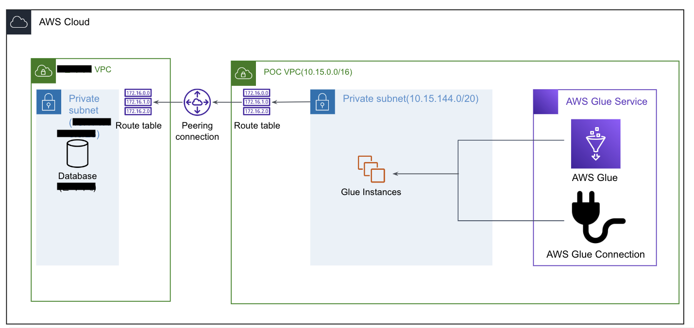

# 5. Glue

💡 [AWS Glue란?](https://www.notion.so/AWS-Glue-21a4e620cac84c54a1960d5f7d801697?pvs=21)

💡 `공통`
IAM Role : `DE-CF-GlueExecute-Role`
- SecretsManager Read/Write
- S3 Full Access
- Glue Service Role

AWS Glue 에서 Job, Crawler를 실행 시킬 때 필요한 Role 을 사전 생성.


## 5.1 Database 생성

- 이름 : {hist account id}-de-enhancement-db
    - 예 : blee-de-enhancement-db


## 5.2 [수행X] Glue Connection 생성(사전 생성 완료)



- AWS Glue connection 을 이용하여 Glue Job을 수행하는 인스턴스들을 어디에서 구동 시킬지 지정할 수 있음
    - Private SG 서로 네트워크 통하도록 처리 해야됨
- `미리 생성 해놓은 Connection 이용`
- Name : `DE-CF-GlueConnection`
- JDBC URL
    - jdbc:postgresql://{db_host}:{db_port}/{db_name}
    - db_host : RDS DNS or IP
    - db_port : Database Port
    - db_name : PostgreSQL databasename
- ID/PW
- VPC
    - RDS 설치된 VPC
    - Subnet : Private Subnet 선택


### [수행X, 사전 처리 완료] 보안그룹 Internal Network Connection

- Glue Job이 최소 2개의 인스턴스로 가동되어 데이터를 주고받는 통신을 수행하게 됨.
- 내부 끼리 통신이 가능해야 Glue 인스턴스끼리 Shuffle과 같은 Network IO를 수행할 수 있다
- 사전에 처리 되어있어 따로 수행할 필요는 없음.


## 5.3 T0, Dimension Data ELT


💡 Glue Job, Crawler 생성


### 5.3.1 Glue Job(Dimension)


💡 Dimension 성 테이블 : customer, products_info, zipcode 를 ETL 하는 Job
1개의 Job으로 3개 테이블 ELT 수행

RDS DB Table → S3 (parquet file)

`코드 변경`
→ Output Path


1. JobName : {hist_mail_id}_jb_de_enhancement_t0_dimension_d2s
    1. 예) blee_jb_de_dehancement_t0_dimension_d2s
2. Glue Version : `3.0`
3. Worker Type : `G 1X`
4. NumberOfWorkers : `2`
5. Script Path : 위에서 지정한 Glue ScriptPath
6. Maximum concurrency : 1
7. Temporary path : 위에서 지정한 Glue Temp Path 
8. Connections : **`5.1** 에서 생성한 Connection 선택`
9. Script 아래 내용 붙여 넣기
    - Script 내 수정 사항
        - `output_path` : 본인 S3 Data Bronze Path으로 변경
    - `Script`
        
        ```python
        import sys
        from awsglue.transforms import *
        from awsglue.utils import getResolvedOptions
        from pyspark.context import SparkContext
        from awsglue.context import GlueContext
        from awsglue.job import Job
        import json
        
        import boto3
        from botocore.exceptions import ClientError
        
        ## @params: [JOB_NAME]
        args = getResolvedOptions(sys.argv, ['JOB_NAME'])
        
        sc = SparkContext()
        glueContext = GlueContext(sc)
        spark = glueContext.spark_session
        
        hadoop_conf = glueContext._jsc.hadoopConfiguration()
        hadoop_conf.set("mapreduce.fileoutputcommitter.marksuccessfuljobs", "false")  # SUCCESS 폴더 생성 방지
        hadoop_conf.set("fs.s3.impl", "org.apache.hadoop.fs.s3a.S3AFileSystem")  # $folder$ 폴더  생성 방지 
        
        job = Job(glueContext)
        job.init(args['JOB_NAME'], args)
        
        def get_secret():
        
            secret_name = "de-enhancement-postgresql-secretsmanager"
            region_name = "ap-northeast-2"
        
            # Create a Secrets Manager client
            session = boto3.session.Session()
            client = session.client(
                service_name='secretsmanager',
                region_name=region_name
            )
        
            try:
                get_secret_value_response = client.get_secret_value(
                    SecretId=secret_name
                )
            except ClientError as e:
                # For a list of exceptions thrown, see
                # https://docs.aws.amazon.com/secretsmanager/latest/apireference/API_GetSecretValue.html
                return None
        
            # Decrypts secret using the associated KMS key.
            secret = get_secret_value_response['SecretString']
            return secret
        
        secret_json_str = get_secret()
        secret_json = json.loads(secret_json_str)
        
        db_host = secret_json['host']
        db_username = secret_json['username']
        db_password = secret_json['password']
        db_port = secret_json['port']
        
        db_url = f'jdbc:postgresql://{db_host}:{db_port}/postgres'
        
        db_schema = 'retail'
        
        dimension_table_list = ['customer', 'products_info', 'zipcode']
        
        for table_name in dimension_table_list:
            customer_df = spark.read.format("jdbc") \
                .option("url",db_url) \
                .option("dbtable",  f"{db_schema}.{table_name}") \
                .option("user",db_username) \
                .option("password",db_password) \
                .load()
            
            output_path = f's3://blee-lab/glue/data/dimension/{table_name}/'
            customer_df.write.mode('overwrite').parquet(output_path) # customer_df.write.mode('overwrite').partitionBy(['sex','age_group']).parquet(output_path)
        
        job.commit()
        ```
        
10. 결과물
    - `캡처`
        
        
        
        
        
        
        
        
        
        - S3 에서 직접 쿼리를 이용하여 데이터 확인이 가능
            
            
            
            
            
        

### 5.3.2 Crawler

S3에 적재 되어있는 데이터 (파일)을 Glue catalog 에 테이블로 생성하기 위한 작업.

Database의 Table처럼 메타 데이터를 관리 할 수 있도록 하는 Glue Catalog를 생성.

- 이름 : {hist_mail_id}_cr_de_enhancement_t0_dimension
    - blee_cr_de_enhancement_t0_dimension
- S3 Path : 본인이 생성한 S3 Bucket 내 Dimension Data 폴더 Path
    - s3://blee-lab/glue/data/dimension/
- IAM Role : 위에서 생성해놓은 IAM Role
- `실습`
    
    
    
    
    
    
    
    
    
    
    
    
    
    
    
    나머지는 Default로 진행 Next → Next → Create crawler
    
- 생성 이후 Run 수행
    - `결과`
        
        
        
        
        
        
        
        
        
        
        

## 5.4 [Glue Job] T0, Fact Data ELT


💡 구매 데이터 초기 적재
총 데이터 : 2,800백만 건

RDS DB Table → S3 (parquet file)

`코드 변경`
→ Output Path

### 5.4.1 Glue Job(Fact, Bronze)

1. JobName : {blee,mail_id}_jb_de_enhancement_t0_fact_d2s
2. Glue Version : 3.0
3. Worker Type : G 1X
4. NumberOfWorkers : 2
    - 데이터 수가 2,800백만 건이라 Worker 가 많이 필요하다. 라고 생각되지만 실제로 DB Connection이 일어날때는 따로 병렬처리 명령을 주지 않는다면 기본적으로 Single thread로 접근을 한다.
5. Script Path : 위에서 지정한 Glue ScriptPath
6. Maximum concurrency : 1
7. Temporary path : 위에서 지정한 Glue Temp Path 
8. Connections : **5.1** 에서 생성한 Connection 선택
9. Output
    1. Partition 지정 : 계열사, 구매년, 구매월
        1. `구매 일까지 나누게되면 데이터가 너무 적음` ⇒ 데이터 크기가 적으면 IO가 많이 일어나 속도가 저하됨.
        2. *구매일 + 2 Worker = 30분 넘게 소요.*
        3. 계열사, 구매년, 월 + Worker 2 + Partition 4 ⇒ 3분 40초
10. Script 아래 내용 붙여 넣기
    - `Script`
        
        ```python
        import sys
        from awsglue.transforms import *
        from awsglue.utils import getResolvedOptions
        from pyspark.context import SparkContext
        from awsglue.context import GlueContext
        from awsglue.job import Job
        from pyspark.sql.functions import col, substring
        
        import json
        import boto3
        from botocore.exceptions import ClientError
        
        ## @params: [JOB_NAME]
        args = getResolvedOptions(sys.argv, ['JOB_NAME'])
        
        sc = SparkContext()
        glueContext = GlueContext(sc)
        spark = glueContext.spark_session
        
        # --
        # -- Overwrite setting
        # --
        spark.conf.set("spark.sql.sources.partitionOverwriteMode","dynamic")  #  없으면 전체 Partition이 overwrite 된다 
        
        hadoop_conf = glueContext._jsc.hadoopConfiguration()
        hadoop_conf.set("mapreduce.fileoutputcommitter.marksuccessfuljobs", "false")  # SUCCESS 폴더 생성 방지
        hadoop_conf.set("fs.s3.impl", "org.apache.hadoop.fs.s3a.S3AFileSystem")  # $folder$ 폴더  생성 방지 
        
        job = Job(glueContext)
        job.init(args['JOB_NAME'], args)
        
        def get_secret():
        
            secret_name = "de-enhancement-postgresql-secretsmanager"
            region_name = "ap-northeast-2"
        
            # Create a Secrets Manager client
            session = boto3.session.Session()
            client = session.client(
                service_name='secretsmanager',
                region_name=region_name
            )
        
            try:
                get_secret_value_response = client.get_secret_value(
                    SecretId=secret_name
                )
            except ClientError as e:
                # For a list of exceptions thrown, see
                # https://docs.aws.amazon.com/secretsmanager/latest/apireference/API_GetSecretValue.html
                return None
        
            # Decrypts secret using the associated KMS key.
            secret = get_secret_value_response['SecretString']
            return secret
        
        secret_json_str = get_secret()
        secret_json = json.loads(secret_json_str)
        
        db_host = secret_json['host']
        db_username = secret_json['username']
        db_password = secret_json['password']
        db_port = secret_json['port']
        
        db_url = f'jdbc:postgresql://{db_host}:{db_port}/postgres'
        
        db_schema = 'retail'
        
        from_date = '20140101'
        to_date = '20141231'
        
        pushdownquery = f"""
        select * from {db_schema}.purchase
        where purchase_date between '{from_date}' and '{to_date}' 
        """
        
        purchase_df = spark.read.format("jdbc") \
            .option("url",db_url) \
            .option("query",  pushdownquery) \
            .option("user",db_username) \
            .option("password",db_password) \
            .load()
        
        # yyyymmdd -> year, month columns to seperate partitions
        purchase_rep_df = purchase_df.repartition(4)
        purchase_rep_df = purchase_rep_df.withColumn("purchase_year", substring(col("purchase_date"),1,4))
        purchase_rep_df = purchase_rep_df.withColumn("purchase_month", substring(col("purchase_date"),5,2))
        #purchase_df = purchase_df.withColumn("purchase_day", substring(col("purchase_date"),7,2))
            
        output_path = f's3://blee-lab/glue/data/fact/bronze/purchase/'
        purchase_rep_df.write.mode('overwrite').partitionBy(['affiliate','purchase_year', 'purchase_month']).parquet(output_path)
        
        job.commit()
        ```
        
11. 결과물
    - `캡처`
        
        
        
        
        
        
        
        
        
        - 파티션을 4개로 나눠서 작업을 수행했어서 결과물이 파일 4개로 떨어진다.
        
        
        
        
        

### 5.4.2 Crawler

S3에 적재 되어있는 데이터 (파일)을 Glue Catalog에 Table 로 생성하기 위한 작업.

Database의 Table처럼 메타 데이터를 관리 할 수 있도록 하는 Glue Catalog를 생성.

- 이름 : cr_de_enhancement_t0_fact
- S3 Path : 본인이 생성한 S3 Bucket 내 Fact Data 폴더명
    - s3://blee-lab/glue/data/fact/bronze/purchase/
- IAM Role : 위에서 생성해놓은 IAM Role
- 순서 : 5.3.1 과 동일하며, S3 Path 지정만 다르다.
- 생성 이후 Run 수행
    - `결과`
        
        
        
        
        
        
        
        
        

## 5.5 [Glue Job] T1, Silver Data

T0에서는 Bronze(Raw Data) 형태로 추후 언제든지 사용될 수 있는 원천 데이터 형태로 데이터를 적재 했다면 Silver Data의 경우 BI 툴 또는 데이터 분석가들이 바로 사용할 수 있도록 비정형화된 데이터 모습으로 생성하려고한다.

즉, 주가 되는 거래 데이터에 나머지 Dimension Data를 Join 해놓은 형태로 적재

사용자가 데이터를 사용할때 마다 Join을 수행해서 사용해도되지만 해당 빈도마다 오버헤드가 발생하며, 컴퓨팅 리소스가 사용된다. 

### 5.5.1 Ad-hoc 분석

> Ad-hoc 분석이란?
라틴어로 ‘특별한 목적을 위해서’라는 뜻으로, 즉각적인 질문(목적)에 데이터로 답을 할 수 있는 일을 의미한다. 
정형화된 결과인 대시보드를 통하지 않고 분석가들이 EDA(탐색적분석), 시각화 등을 통해 인사이트를 도출하고자하는 분석 방법을 의미함.
> 


- `Athena`
    - SQL
        
        ```sql
        WITH customer_info AS (
            SELECT *
              FROM "customer" c
              LEFT JOIN "zipcode" z
                on c."residence" = z."short_zipcode"
             WHERE 1=1
        )
        select * from (select * from "purchase"
        where "affiliate" = 'A'
        and purchase_year = '2014'
        and purchase_month = '01'
        order by "purchase_date", "purchase_time") p201401
        left join customer_info c
        on p201401."customer_id" = c."customer_id"
        left join "products_info" pi
        on (p201401."affiliate" = pi."affiliate"
            and p201401."division_cd" = pi."division_cd" 
            and p201401."main_category_cd" = pi."main_category_cd" 
            and p201401."sub_category_cd" = pi."sub_category_cd" )
        limit 20
        ```
        
    
    
    
    
    
    위와 같은 쿼리를 이용하여 GroupBy 와 같은 집계 연산을 수행하려고한다면 SQL의 복잡도가 더욱 높아 질 것입니다. 그리하여 우리는 해당 결과물을 Glue Data Catalog로 테이블화 시킬 것입니다.
    

### 5.5.2 Glue Job


💡 Glue Job, Crawler 생성

Fact 테이블(purchase)를 중심으로 customer + zipcode, products_info를 left join을 수행하는 ETL 작업 수행

S3 (parquet file) → S3(parquet file)

`코드 변경`
→ Output Path


1. JobName : {blee,mail_id}_jb_de_enhancement_t1_fulljoin_s2s
2. Glue Version : 3.0
3. Worker Type : G 1X
4. NumberOfWorkers : 4
5. Script Path : 위에서 지정한 Glue ScriptPath
6. Maximum concurrency : 1
7. Temporary path : 위에서 지정한 Glue Temp Path 
8. ~~Connections : **5.1** 에서 생성한 Connection 선택~~
    1. Glue Catalog를 활용할때는 Connection이 필요 없음
9. Script 아래 내용 붙여 넣기
    - Glue 작업 진행 중 DataFrame끼리 Join하다 보니 최종 Partition의 수가 40개로 늘어남에 따라 개별 파일의 용량이 줄고 수가 늘어나게되면 추후 분석에 IO 가 늘어남에 따라 Repartition을 수행하여 파티션수를 줄이는 작업도 코드에 포함.
    - `변경이 필요한 부분`
        - Glue Database 명
        - Output Path
    - `Script`
        
        ```python
        import sys
        from awsglue.transforms import *
        from awsglue.utils import getResolvedOptions
        from pyspark.context import SparkContext
        from awsglue.context import GlueContext
        from awsglue.job import Job
        from pyspark.sql.functions import col, substring
        
        import json
        import boto3
        from botocore.exceptions import ClientError
        
        ## @params: [JOB_NAME]
        args = getResolvedOptions(sys.argv, ['JOB_NAME'])
        
        sc = SparkContext()
        glueContext = GlueContext(sc)
        spark = glueContext.spark_session
        
        # --
        # -- Overwrite setting
        # --
        spark.conf.set("spark.sql.sources.partitionOverwriteMode","dynamic")  #  없으면 전체 Partition이 overwrite 된다 
        
        job = Job(glueContext)
        job.init(args['JOB_NAME'], args)
        
        hadoop_conf = glueContext._jsc.hadoopConfiguration()
        hadoop_conf.set("mapreduce.fileoutputcommitter.marksuccessfuljobs", "false")  # SUCCESS 폴더 생성 방지
        hadoop_conf.set("fs.s3.impl", "org.apache.hadoop.fs.s3a.S3AFileSystem")  # $folder$ 폴더  생성 방지 
        
        glue_database_name = "de-enhancement-db"
        
        # --
        # -- DIMENSION : ZIPCODE, CUSTOMER, PRODUCTS_INFO
        # --
        
        # glue catalog에서 glue dynamic frame으로 데이터를 읽은 후 Spark DataFrame으로 변환
        customer_dynamic_frame = glueContext.create_dynamic_frame.from_catalog(database=glue_database_name
                                                                    , table_name = 'customer')
        customer_df = customer_dynamic_frame.toDF()
        
        zipcode_dynamic_frame = glueContext.create_dynamic_frame.from_catalog(database=glue_database_name
                                                                    , table_name = 'zipcode')
        zipcode_df = zipcode_dynamic_frame.toDF()
        
        products_info_dynamic_frame = glueContext.create_dynamic_frame.from_catalog(database=glue_database_name
                                                                    , table_name = 'products_info')
        products_info_df = products_info_dynamic_frame.toDF()
        
        # Customer + Zipcode Jon
        
        customer_with_zipcode_df = customer_df.join(zipcode_df, customer_df['residence'] == zipcode_df['short_zipcode'], "left")\
                                                .drop(zipcode_df.short_zipcode)
        #customer_with_zipcode_df.show(3)
        
        # --
        # -- FACT : PURCHASE
        # --
        
        purchase_year = '2014'
        purchase_from_month = '01'
        purchase_to_month = '12'
        
        push_down_predicate = f"purchase_year={purchase_year} and purchase_month between {purchase_from_month} and {purchase_to_month}"
        
        purchase_dynamic_frame = glueContext.create_dynamic_frame.from_catalog(database = glue_database_name, 
                                                                            table_name = 'purchase',
                                                                            push_down_predicate = f"({push_down_predicate})")
        purchase_df = purchase_dynamic_frame.toDF()
        
        purchase_product_df = purchase_df.join(products_info_df
                                        , (purchase_df['affiliate'] == products_info_df['affiliate']) &
                                            (purchase_df['division_cd'] == products_info_df['division_cd']) & 
                                            (purchase_df['main_category_cd'] == products_info_df['main_category_cd']) &
                                            (purchase_df['sub_category_cd'] == products_info_df['sub_category_cd'])
                                        , "left")\
                                            .drop(products_info_df.affiliate)\
                                            .drop(products_info_df.division_cd)\
                                            .drop(products_info_df.main_category_cd)\
                                            .drop(products_info_df.sub_category_cd)
        
        purchase_full_df = purchase_product_df.join(customer_with_zipcode_df
                                                , purchase_product_df['customer_id'] == customer_with_zipcode_df['customer_id']
                                                , "left")\
                                                .drop(customer_with_zipcode_df.customer_id)
        
        #purchase_full_df.repartition(2)
        
        output_path = output_path = f's3://blee-lab/glue/data/fact/silver/purchase_all_info/'
        purchase_full_df.coalesce(1).write.mode('overwrite').partitionBy(['affiliate','purchase_year', 'purchase_month']).parquet(output_path)
        
        job.commit()
        ```
        
10. 결과물
    - `캡쳐`
        
        
        
        
        

### 5.5.3 Crawler

- 이름 : {blee}_cr_de_enhancement_t1_purchase_all
- S3 Path : 본인이 생성한 S3 Bucket 내 Fact Data → Silver 폴더 내 테이블명으로 지정
    - s3://blee-lab/glue/data/fact/silver/purchase_all_info/
- IAM Role : 위에서 생성해놓은 IAM Role
- 순서 : 5.3.1 과 동일하며, S3 Path 지정만 다르다.
- 생성 이후 Run 수행
    - `결과`
        
        
        
        
        
        
        
        
        

## 5.6 [Glue Job] T2, Gold Data


💡 대부분의 Gold Data의 경우 Summary된 형태의 데이터를 많이 생성한다. 
GroupBy, Sum, Avg 등 BI 또는 리포트에 맞는 형태로 데이터를 변환하여 적재 수행
해당 실습은 데이터 분석을 목적으로 하는게 아니라 엔지니어링을 목적으로 하기에 간단한 지표만 생성할 예정


### 5.6.1 주제

> 해당 주제는 임의로 정의한 주제로, 추후 개별적으로 실습하실때는 다르게 주제를 잡아서 수행해도 됩니다.
> 
1. 계열사
    1. 년, 월, 일 매출, 건수
        - `SQL`
            
            ```sql
            SELECT 
                "affiliate"
                , "purchase_year"
                , "purchase_month"
                , round(sum(amount) / 1000000,2) as sum_of_amount
                , count(amount) as cnt_purchase 
                FROM "AwsDataCatalog"."de-enhancement-db"."purchase_all_info"
            group by "affiliate", "purchase_year", "purchase_month"
            order by affiliate, purchase_year, purchase_month
            ```
            
    2. 요일, 시간 매출, 건수
        - `SQL`
            
            ```sql
            -- Monday 1, Tuesday 2, Wednesday 3, Thursday 4, Friday 5, Saturday 6, Sunday 7
            SELECT 
                "affiliate"
                , date_format(date_parse(purchase_date, '%Y%m%d'), '%W') as day_of_week
                , day_of_week(date_parse(purchase_date, '%Y%m%d')) as day_of_week_num
                , "purchase_time"
                , round(sum(amount) / 1000000,2) as sum_of_amount
                , count(amount) as cnt_purchase 
                FROM "AwsDataCatalog"."de-enhancement-db"."purchase_all_info"
            group by 1,2,3,4
            order by 1,3,4
            ```
            
    3. 제품 (카테고리) 별 매출
        - `SQL`
            
            ```sql
            SELECT 
                "affiliate"
                , "division_cd"
                , "main_category_desc"
                , "sub_category_desc"
                , round(sum(amount) / 1000000,2) as sum_of_amount
                , count(amount) as cnt_purchase 
            FROM "AwsDataCatalog"."de-enhancement-db"."purchase_all_info"
            Group by 1,2,3,4
            order by 1,2,3,4
            ```
            
    4. 연령대별, 제품(카테고리)별 매출
        - `SQL`
            
            ```sql
            SELECT 
                "affiliate"
                ,"age_group"
                , "division_cd"
                , "main_category_desc"
                , "sub_category_desc"
                , round(sum(amount) / 1000000,2) as sum_of_amount
                , count(amount) as cnt_purchase 
            FROM "AwsDataCatalog"."de-enhancement-db"."purchase_all_info"
            Group by 1,2,3,4,5
            order by 1,2,6 desc
            ```
            
    5. 지역별 매출
        - `SQL`
            
            ```sql
            SELECT 
                "affiliate"
                ,"province_city"
                ,"city_county"
                , round(sum(amount) / 1000000,2) as sum_of_amount
                , count(amount) as cnt_purchase 
            FROM "AwsDataCatalog"."de-enhancement-db"."purchase_all_info"
            Group by 1,2,3
            order by 1,4 desc
            ```
            
2. 고객
    1. 계열사, 전체 구매 건수, 고객 수, 평균 구매 금액, 평균 구매 횟수
        - `SQL`
            
            ```sql
            SELECT 
                "affiliate"
                , count(distinct "customer_id") as number_of_customer
                , count("customer_id") as cnt_of_purchase
                , count("customer_id") / count(distinct "customer_id") as avg_number_of_purchase
                , round(sum("amount") / count("customer_id") / 10000,2) as avg_purchase_amount
                , round(sum("amount") / count(distinct "customer_id") / 10000,2) as avg_purchase_amount_per_customer
            FROM "AwsDataCatalog"."de-enhancement-db"."purchase_all_info"
            Group by 1
            Order by 1
            ```
            
    2. 계열사, 년, 월 별 구매 건수, 구매 금액
        - `SQL`
            
            ```sql
            SELECT 
                "affiliate"
                , "customer_id"
                , "purchase_year"
                , "purchase_month"
                , count("customer_id") as cnt_of_purchase
                , round(sum("amount") / count("customer_id") / 10000,2) as avg_purchase_amount
            FROM "AwsDataCatalog"."de-enhancement-db"."purchase_all_info"
            Group by 1, 2, 3, 4
            Order by 1, 2, 3, 4
            ```
            

### 5.6.2 Glue Job(4개)


💡 Glue Job 생성하고 Detail 속성들은 위에 작업했었던 Glue와 동일하거나 Worker 수만 조절하여 진행 
따로 작성하지 않겠습니다. 

`코드 변경`
→ Output Path


1. 계열사별 + 년 + 월 + 일 + 시간 + 요일 + 매출 건수 + 매출 금액
    - 이름 : {blee}_jb_de_enhancement_t2_salesbydatetime_s2s
    - `변경이 필요한 부분`
        - Glue Database 명
        - Output Path
    - `Script`
        
        ```python
        # # 1. 계열사별 + 년 + 월 + 일 + 시간 + 요일 + 매출 건수 + 매출 금액
        import sys
        from awsglue.transforms import *
        from awsglue.utils import getResolvedOptions
        from pyspark.context import SparkContext
        from awsglue.context import GlueContext
        from awsglue.job import Job
        from pyspark.sql.functions import col, substring, count, sum, udf
        
        from datetime import datetime
        import json
        import boto3
        from botocore.exceptions import ClientError
        
        # @params: [JOB_NAME]
        args = getResolvedOptions(sys.argv, ['JOB_NAME'])
        
        sc = SparkContext()
        glueContext = GlueContext(sc)
        spark = glueContext.spark_session
        
        # --
        # -- Overwrite setting
        # --
        spark.conf.set("spark.sql.sources.partitionOverwriteMode","dynamic")  #  없으면 전체 Partition이 overwrite 된다 
        
        job = Job(glueContext)
        job.init(args['JOB_NAME'], args)
        
        hadoop_conf = glueContext._jsc.hadoopConfiguration()
        hadoop_conf.set("mapreduce.fileoutputcommitter.marksuccessfuljobs", "false")  # SUCCESS 폴더 생성 방지
        hadoop_conf.set("fs.s3.impl", "org.apache.hadoop.fs.s3a.S3AFileSystem")  # $folder$ 폴더  생성 방지 
        
        glue_database_name = "de-enhancement-db"
        
        # --
        # -- FACT : purchase_all_info
        # --
        
        purchase_year = '2014'
        purchase_from_month = '01'
        purchase_to_month = '12'
        
        push_down_predicate = f"purchase_year={purchase_year} and purchase_month between {purchase_from_month} and {purchase_to_month}"
        
        purchase_all_info_dynamic_frame = glueContext.create_dynamic_frame.from_catalog(database = glue_database_name, 
                                                                            table_name = 'purchase_all_info',
                                                                            push_down_predicate = f"({push_down_predicate})")
        
        purchase_all_info_df = purchase_all_info_dynamic_frame.toDF()
        purchase_all_info_df = purchase_all_info_df.withColumn("purchase_day", substring(col("purchase_date"),7,2))
        
        purchase_all_info_df.cache()
        
        purchase_all_info_df.show(3)
        
        ## 계열사, 년, 월, 일, 시간 + 매출 건수, 매출 금액 
        
        grouped_purchase_df = purchase_all_info_df.groupBy(['affiliate', 'purchase_year', 'purchase_month', 'purchase_day', 'purchase_time'])\
                                                    .agg(sum("amount").alias("total_purchase_amount"), count("amount").alias("count_of_purchase"))
        
        ## Group By  결과물에 요일 추가 
        def change_day_of_week(year: str, month: str, day: str):
            try:
                date_string = f"{year}{month}{day}"
                # Convert the date string to a datetime object
                date_object = datetime.strptime(date_string, '%Y%m%d')
                # Get the day of the week as an integer (0 = Monday, 6 = Sunday)
                day_of_week = date_object.weekday()
                # Convert the integer to the corresponding day name
                day_name = date_object.strftime('%A')
                return day_name
            except ValueError:
                return "Invalid date format. Please"
        
        #print(change_day_of_week('2014','11','12') == 'Wednesday')
        
        change_day_of_week_udf = udf(change_day_of_week)
        
        grouped_purchase_df = grouped_purchase_df.withColumn("day_of_week", change_day_of_week_udf(col("purchase_year"), col("purchase_month"), col("purchase_day")))
        
        grouped_purchase_df = grouped_purchase_df.select('affiliate','purchase_year','purchase_month','purchase_day','day_of_week','purchase_time','total_purchase_amount','count_of_purchase')
        
        output_path = output_path = f's3://blee-lab/glue/data/fact/gold/mart_salesbydatetime/'
        grouped_purchase_df.coalesce(1).write.mode('overwrite').partitionBy(['affiliate','purchase_year','purchase_month']).parquet(output_path)
        
        job.commit()
        ```
        
    
    
    
    
    
2. 계열사별 + 연령별 + 제품(카테고리)별 매출
    - 이름 : {blee}_jb_de_enhancement_t2_salesbyageproducts_s2s
    - `변경이 필요한 부분`
        - Glue Database 명
        - Output Path
    - `Script`
        
        ```python
        # # 2. 계열사별 + 연령별 + 제품(카테고리)별 매출
        import sys
        from awsglue.transforms import *
        from awsglue.utils import getResolvedOptions
        from pyspark.context import SparkContext
        from awsglue.context import GlueContext
        from awsglue.job import Job
        from pyspark.sql.functions import col, substring, count, sum
        
        import json
        import boto3
        from botocore.exceptions import ClientError
        
        ## @params: [JOB_NAME]
        args = getResolvedOptions(sys.argv, ['JOB_NAME'])
        
        sc = SparkContext()
        glueContext = GlueContext(sc)
        spark = glueContext.spark_session
        
        # --
        # -- Overwrite setting
        # --
        spark.conf.set("spark.sql.sources.partitionOverwriteMode","dynamic")  #  없으면 전체 Partition이 overwrite 된다 
        
        job = Job(glueContext)
        job.init(args['JOB_NAME'], args)
        
        hadoop_conf = glueContext._jsc.hadoopConfiguration()
        hadoop_conf.set("mapreduce.fileoutputcommitter.marksuccessfuljobs", "false")  # SUCCESS 폴더 생성 방지
        hadoop_conf.set("fs.s3.impl", "org.apache.hadoop.fs.s3a.S3AFileSystem")  # $folder$ 폴더  생성 방지 
        
        glue_database_name = "de-enhancement-db"
        
        # --
        # -- FACT : purchase_all_info
        # --
        
        purchase_year = '2014'
        purchase_from_month = '01'
        purchase_to_month = '12'
        
        push_down_predicate = f"purchase_year={purchase_year} and purchase_month between {purchase_from_month} and {purchase_to_month}"
        
        purchase_all_info_dynamic_frame = glueContext.create_dynamic_frame.from_catalog(database = glue_database_name, 
                                                                            table_name = 'purchase_all_info',
                                                                            push_down_predicate = f"({push_down_predicate})")
        
        purchase_all_info_df = purchase_all_info_dynamic_frame.toDF()
        
        purchase_all_info_df.cache()
        purchase_all_info_df.show(3)
        
        ## 계열사별 + 연령별 + 제품(카테고리)별 + 매출 건수, 매출 금액 
        grouped_purchase_df = purchase_all_info_df.groupBy(['affiliate', 'purchase_year', 'purchase_month', 'age_group', 'division_cd', 'main_category_desc', 'sub_category_desc'])\
                                                    .agg(sum("amount").alias("total_purchase_amount"), count("amount").alias("count_of_purchase"))
        
        grouped_purchase_df.show(3)
        
        output_path = output_path = f's3://blee-lab/glue/data/fact/gold/mart_salesbyageproducts/'
        grouped_purchase_df.coalesce(1).write.mode('overwrite').partitionBy(['affiliate','purchase_year','purchase_month']).parquet(output_path)
        
        job.commit()
        ```
        
    
    
    
    
    
3. 계열사별 + 지역별 + 매출
    - 이름 : {blee}_jb_de_enhancement_t2_salesbyresidence_s2s
    - `변경이 필요한 부분`
        - Glue Database 명
        - Output Path
    - `Script`
        
        ```python
        # # 계열사별, 지역별, 매출
        
        import sys
        from awsglue.transforms import *
        from awsglue.utils import getResolvedOptions
        from pyspark.context import SparkContext
        from awsglue.context import GlueContext
        from awsglue.job import Job
        from pyspark.sql.functions import col, substring, count, sum
        
        import json
        import boto3
        from botocore.exceptions import ClientError
        
        ## @params: [JOB_NAME]
        args = getResolvedOptions(sys.argv, ['JOB_NAME'])
        
        sc = SparkContext()
        glueContext = GlueContext(sc)
        spark = glueContext.spark_session
        
        # --
        # -- Overwrite setting
        # --
        spark.conf.set("spark.sql.sources.partitionOverwriteMode","dynamic")  #  없으면 전체 Partition이 overwrite 된다 
        
        job = Job(glueContext)
        job.init(args['JOB_NAME'], args)
        
        hadoop_conf = glueContext._jsc.hadoopConfiguration()
        hadoop_conf.set("mapreduce.fileoutputcommitter.marksuccessfuljobs", "false")  # SUCCESS 폴더 생성 방지
        hadoop_conf.set("fs.s3.impl", "org.apache.hadoop.fs.s3a.S3AFileSystem")  # $folder$ 폴더  생성 방지 
        
        glue_database_name = "de-enhancement-db"
        
        # --
        # -- FACT : purchase_all_info
        # --
        
        purchase_year = '2014'
        purchase_from_month = '01'
        purchase_to_month = '12'
        
        push_down_predicate = f"purchase_year={purchase_year} and purchase_month between {purchase_from_month} and {purchase_to_month}"
        
        purchase_all_info_dynamic_frame = glueContext.create_dynamic_frame.from_catalog(database = glue_database_name, 
                                                                            table_name = 'purchase_all_info',
                                                                            push_down_predicate = f"({push_down_predicate})")
        
        purchase_all_info_df = purchase_all_info_dynamic_frame.toDF()
        purchase_all_info_df.cache()
        
        purchase_all_info_df.show(3)
        
        residence_grouped_purchase_df = purchase_all_info_df.groupBy(['affiliate', 'purchase_year', 'purchase_month','province_city', 'city_county'])\
                                                    .agg(sum("amount").alias("total_purchase_amount"), count("amount").alias("count_of_purchase"))\
                                                    .sort(col("affiliate"), col('purchase_year'), col('purchase_month'), col('total_purchase_amount').desc(), col('count_of_purchase').desc())
        
        residence_grouped_purchase_df.show(3)
        
        # month 까지 partition을 나누게 되면 1개 파일이 2.4k 로 되서 오히려 Read/Write Overhead가 발생
        # 사실상 현재 파일 크기로 봤을떈 그냥 1개 파일로 만들어도되나 추후 데이터가 늘어난다는 전제하에 Partition Split
        output_path = output_path = f's3://blee-lab/glue/data/fact/gold/mart_salesbyresidence/'
        residence_grouped_purchase_df.coalesce(1).write.mode('overwrite').partitionBy(['affiliate','purchase_year','purchase_month']).parquet(output_path)
        
        job.commit()
        ```
        
    
    
    
    
    
4. 고객별 + 각 계열사 + 년 + 월 + 구매 건수 + 구매 금액
    - 이름 :  {blee}_jb_de_enhancement_t2_salesbycustomer_s2s
    - `변경이 필요한 부분`
        - Glue Database 명
        - Output Path
    - `Script`
        
        ```python
        # # 4. 계열사별 + 연령별 + 제품(카테고리)별 매출
        import sys
        from awsglue.transforms import *
        from awsglue.utils import getResolvedOptions
        from pyspark.context import SparkContext
        from awsglue.context import GlueContext
        from awsglue.job import Job
        from pyspark.sql.functions import col, substring, count, sum
        
        import json
        import boto3
        from botocore.exceptions import ClientError
        
        ## @params: [JOB_NAME]
        args = getResolvedOptions(sys.argv, ['JOB_NAME'])
        
        sc = SparkContext()
        glueContext = GlueContext(sc)
        spark = glueContext.spark_session
        
        # --
        # -- Overwrite setting
        # --
        spark.conf.set("spark.sql.sources.partitionOverwriteMode","dynamic")  #  없으면 전체 Partition이 overwrite 된다 
        
        job = Job(glueContext)
        job.init(args['JOB_NAME'], args)
        
        hadoop_conf = glueContext._jsc.hadoopConfiguration()
        hadoop_conf.set("mapreduce.fileoutputcommitter.marksuccessfuljobs", "false")  # SUCCESS 폴더 생성 방지
        hadoop_conf.set("fs.s3.impl", "org.apache.hadoop.fs.s3a.S3AFileSystem")  # $folder$ 폴더  생성 방지 
        
        glue_database_name = "de-enhancement-db"
        
        # --
        # -- FACT : purchase
        # --
        
        purchase_year = '2014'
        purchase_from_month = '01'
        purchase_to_month = '12'
        
        push_down_predicate = f"purchase_year={purchase_year} and purchase_month between {purchase_from_month} and {purchase_to_month}"
        
        purchase_dynamic_frame = glueContext.create_dynamic_frame.from_catalog(database = glue_database_name, 
                                                                            table_name = 'purchase',
                                                                            push_down_predicate = f"({push_down_predicate})")
        
        purchase_df = purchase_dynamic_frame.toDF()
        
        purchase_df.cache()
        purchase_df.show(3)
        
        grouped_purchase_df = purchase_df.groupBy(['customer_id', 'affiliate', 'purchase_year','purchase_month'])\
                    .agg(sum("amount").alias("total_purchase_amount"), count("amount").alias("count_of_purchase"))
        
        grouped_purchase_df.show(3)
        
        # ## Customer + Zipcode Info Join
        
        # glue catalog에서 glue dynamic frame으로 데이터를 읽은 후 Spark DataFrame으로 변환
        customer_dynamic_frame = glueContext.create_dynamic_frame.from_catalog(database=glue_database_name
                                                                    , table_name = 'customer')
        customer_df = customer_dynamic_frame.toDF()
        
        zipcode_dynamic_frame = glueContext.create_dynamic_frame.from_catalog(database=glue_database_name
                                                                    , table_name = 'zipcode')
        zipcode_df = zipcode_dynamic_frame.toDF()
        
        # Customer + Zipcode Jon
        
        customer_with_zipcode_df = customer_df.join(zipcode_df, customer_df['residence'] == zipcode_df['short_zipcode'], "left")\
                                                .drop(zipcode_df.short_zipcode)
        
        grouped_purchase_full_df = grouped_purchase_df.join(customer_with_zipcode_df
                                                , grouped_purchase_df['customer_id'] == customer_with_zipcode_df['customer_id']
                                                , "left")\
                                                .drop(customer_with_zipcode_df.customer_id)
        
        grouped_purchase_full_df.show(3)
        
        output_path = output_path = f's3://blee-lab/glue/data/fact/gold/mart_salesbycustomer/'
        grouped_purchase_full_df.coalesce(1).write.mode('overwrite').partitionBy(['affiliate','purchase_year','purchase_month']).parquet(output_path)
        
        job.commit()
        ```
        
    
    
    
    
    

### 5.6.3 Crawler(4개)

위 각 주제에 맞게 S3 Path만 지정하여 4개 크롤러 생성 

1. 계열사별 + 년 + 월 + 일 + 시간 + 요일 + 매출 건수 + 매출 금액
    - 이름 : {blee}_cr_de_enhancement_t2_salesbydatetime
2. 계열사별 + 연령별 + 제품(카테고리)별 매출
    1. 이름 : {blee}_cr_de_enhancement_t2_salesbyageproducts
3. 계열사별 + 지역별 + 매출
    1. 이름 : {blee}_cr_de_enhancement_t2_salesbyresidence
4. 고객별 + 각 계열사 + 년 + 월 + 구매 건수 + 구매 금액
    1. 이름 : {blee}_cr_de_enhancement_t2_salesbycustomer


# 6. Stepfunction


💡 아래 상태 머신 생성하는 방법을 그대로 수행하시는게 익힐 수 있는 가장 빠른 방법으로 생각됩니다. 
하지만 시간이 부족하거나 복잡하다고 생각하시는 분들께서는 금일 교육에서는 아래 전체 Json 파일을 복사 하셔 코드로 적용하기로 적용 후 본인이 생성한 리소스 명으로 변경하는 작업만 수행하셔도 무방할 것 으로 판단됩니다. 
전체 상태 머신 Json 파일 : [`Json`](https://www.notion.so/Json-f15c8804eafd430aa3f24f11796ee232?pvs=21)


## 6.1 상태 머신 생성

- [Stepfunction Console](https://ap-northeast-2.console.aws.amazon.com/states/home?region=ap-northeast-2#/statemachines)


## 6.2 Step 생성


💡 T0 → T1 → T2 순서대로 작업을 수행
실제 현업에서 사용하려면 파라미터를 통해 날짜(년월일)을 파라미터로 하여 조회하는 날짜를 변경하여 각 Step이 진행되도록 해야되나 아래 작업은 Glue Job Script에 지정된 날짜로 조회되도록 진행


### 6.2.1 T0 Bronze Flow

1. Parallel 작업 추가
2. `StartJobRun` 2개 작업 병렬로 적용
    1. 작업 1 : T0 Dimension Job
        1. *태스트 완료 대기(Glue Job 이 모두 완료 될때까지)*
    2. 작업 2 : T0 Fact Job
        1. *태스트 완료 대기(Glue Job 이 모두 완료 될때까지)*
    
    
    
3. 각 Job 과 연결되는 Crawler (`StartCrawler`)
    1. cr_de_enhancement_t0_dimension
    2. cr_de_enhancement_t0_fact
    3. 태스트 완료 대기 X
        1. Crawler 에서는 적용이 안됨.
    
    
    
4. 각 Crawler 의 상태를 확인하여 작업 완료 여부를 확인하고자 `GetCrawler`와 `Choice`를 이용
    1. `GetCrawler`
        1. Crawler 현재 어느 상태인지 확인하는 Step → 결과를 다음 Job 으로 전달하기 위한 단계이기도함.
        2. Start Crawler 와 같은 Name을 API 파라미터로 입력
        - `결과물`
            
            아래 내용이 GetCrawler를 통해 전달되는 결과물인데 "State": "STOPPING" 값을 이용
            
            ```json
            {
            	"Crawler": {
            	      "Classifiers": [],
            	      "CrawlElapsedTime": 49000,
            	      "CreationTime": "2022-08-19T06:46:42Z",
            	      "DatabaseName": "hist-retail",
            	      "LakeFormationConfiguration": {
            	        "AccountId": "",
            	        "UseLakeFormationCredentials": false
            	      },
            	      "LastCrawl": {
            	        "LogGroup": "/aws-glue/crawlers",
            	        "LogStream": "cr_retail_factdata_sales",
            	        "MessagePrefix": "62ef7b9f-e54d-4b54-805c-d29e905ac4e4",
            	        "StartTime": "2022-08-19T08:01:25Z",
            	        "Status": "SUCCEEDED"
            	      },
            	      "LastUpdated": "2022-08-19T07:12:38Z",
            	      "LineageConfiguration": {
            	        "CrawlerLineageSettings": "DISABLE"
            	      },
            	      "Name": "cr_retail_factdata_sales",
            	      "RecrawlPolicy": {
            	        "RecrawlBehavior": "CRAWL_NEW_FOLDERS_ONLY"
            	      },
            	      "Role": "AWSGlueServiceRole-PipelineRole",
            	      "SchemaChangePolicy": {
            	        "DeleteBehavior": "LOG",
            	        "UpdateBehavior": "LOG"
            	      },
            	      "State": "STOPPING", // 다음 Step Choice State에서 사용할 Key값.
            	      "Targets": {
            	        "CatalogTargets": [],
            	        "DeltaTargets": [],
            	        "DynamoDBTargets": [],
            	        "JdbcTargets": [],
            	        "MongoDBTargets": [],
            	        "S3Targets": [
            	          {
            	            "Exclusions": [
            	              "**/_temporary/**"
            	            ],
            	            "Path": "s3://hist-retail/factdata/sales"
            	          }
            	        ]
            	      },
            	      "Version": 4
            	    }
            }
            ```
            
        
        
        
    2. `Choice` - 2개 동일하게 적용
        1. Crawler의 상태에 따라 Wait를 할 것인지 Success를 진행 할 것인지 판단.
            
            
            
            
            
        2. Rules 에 아래와 같은 내용을 추가 
            - 전체 식
                - $.Crawler.State == "RUNNING"
            - `Variable`
                - $.Crawler.State
            - `Operator`
                - is equal to
            - `Value`
                - String constant
            - `Text`
                - RUNNING
            
            
            
        3. RUNNING 연결부분에는 Wait → 다음 상태를 해당 Choice위의 GetCrawler 로 선택
            1. 예) T0 Dimension Choice → Wait → T0 Dimension GetCrawler
            
            
            
    
5. 최종 결과물 및 실행 결과
    
    
    
    
    

### 6.2.2 T1 Silver Flow (Full Join)

Silver Data인 전체 데이터를 Join 한 결과물을 만드는 순서

방벙은 위와 동일하게 StartJob → Crawler → Check Crawler Status → Next

1. StartJobRun
    1. 이름 : jb_de_enhancement_t1_fulljoin_s2s
    2. 태스크 완료 대기 선택
    
    
    
2. Crawler 실행 및 상태 체크 
    1. StartCrawler
        1. 이름 : cr_de_enhancement_t1_purchase_all
    2. GetCrawler
        1. 이름 : cr_de_enhancement_t1_purchase_all
    3. Choice
        1. Condition : 위에서 적용했던 Choice와 같음
        2. Default → Gold Data Flow로 가도록 처리
    
    
    

### 6.2.3 T2 Gold Flow(Data Mart)

총 4개의 마트를 생성 → Job 4, Crawler 4개 수행

단, 마지막 단계이므로 Status Check는 하지 않고 마무리함

1. 병렬 처리를 위한 `Parallel` 추가
2. 4개의 Glue Job Start 추가 
    1. 각 Job 이름 입력 
        1. jb_de_enhancement_t2_salesbyageproducts_s2s
        2. jb_de_enhancement_t2_salesbycustomer_s2s
        3. jb_de_enhancement_t2_salesbydatetime_s2s
        4. jb_de_enhancement_t2_salesbyresidence_s2s
    2. 각 태스크 완료 대기 선택
3. 각각 Job 에 맞는 Crawler를 다음 Step으로 입력
    1. 이름
        1. cr_de_enhancement_t2_salesbyageproducts
        2. cr_de_enhancement_t2_salesbycustomer
        3. cr_de_enhancement_t2_salesbydatetime
        4. cr_de_enhancement_t2_salesbyresidence


### 6.2.4 최종 전체 Step

1. 소요 시간
    - 초기 적재 : 20분
    - 증분 적재 : 10분
2. 전체 Json File
    - `Json`
        
        ```json
        {
          "Comment": "A description of my state machine",
          "StartAt": "T0 : Parallel",
          "States": {
            "T0 : Parallel": {
              "Type": "Parallel",
              "Branches": [
                {
                  "StartAt": "T0 Dimension Start Job",
                  "States": {
                    "T0 Dimension Start Job": {
                      "Type": "Task",
                      "Resource": "arn:aws:states:::glue:startJobRun.sync",
                      "Parameters": {
                        "JobName": "jb_de_enhancement_t0_dimension_d2s"
                      },
                      "Next": "T0 Dimension StartCrawler"
                    },
                    "T0 Dimension StartCrawler": {
                      "Type": "Task",
                      "Parameters": {
                        "Name": "cr_de_enhancement_t0_dimension"
                      },
                      "Resource": "arn:aws:states:::aws-sdk:glue:startCrawler",
                      "Next": "T0 Dimension GetCrawler"
                    },
                    "T0 Dimension GetCrawler": {
                      "Type": "Task",
                      "Parameters": {
                        "Name": "cr_de_enhancement_t0_dimension"
                      },
                      "Resource": "arn:aws:states:::aws-sdk:glue:getCrawler",
                      "Next": "T0 Dimension Choice"
                    },
                    "T0 Dimension Choice": {
                      "Type": "Choice",
                      "Choices": [
                        {
                          "Variable": "$.Crawler.State",
                          "StringEquals": "RUNNING",
                          "Next": "Wait T0 Dimension"
                        }
                      ],
                      "Default": "Success T0 Dimension"
                    },
                    "Wait T0 Dimension": {
                      "Type": "Wait",
                      "Seconds": 5,
                      "Next": "T0 Dimension GetCrawler"
                    },
                    "Success T0 Dimension": {
                      "Type": "Succeed"
                    }
                  }
                },
                {
                  "StartAt": "T0 Fact Start Job",
                  "States": {
                    "T0 Fact Start Job": {
                      "Type": "Task",
                      "Resource": "arn:aws:states:::glue:startJobRun.sync",
                      "Parameters": {
                        "JobName": "jb_de_enhancement_t0_fact_d2s"
                      },
                      "Next": "T0 Fact StartCrawler"
                    },
                    "T0 Fact StartCrawler": {
                      "Type": "Task",
                      "Parameters": {
                        "Name": "cr_de_enhancement_t0_fact"
                      },
                      "Resource": "arn:aws:states:::aws-sdk:glue:startCrawler",
                      "Next": "T0 Fact GetCrawler"
                    },
                    "T0 Fact GetCrawler": {
                      "Type": "Task",
                      "Parameters": {
                        "Name": "cr_de_enhancement_t0_fact"
                      },
                      "Resource": "arn:aws:states:::aws-sdk:glue:getCrawler",
                      "Next": "T0 Fact Choice"
                    },
                    "T0 Fact Choice": {
                      "Type": "Choice",
                      "Choices": [
                        {
                          "Variable": "$.Crawler.State",
                          "StringEquals": "RUNNING",
                          "Next": "Wait T0 Fact"
                        }
                      ],
                      "Default": "Success T1 Dimension"
                    },
                    "Wait T0 Fact": {
                      "Type": "Wait",
                      "Seconds": 5,
                      "Next": "T0 Fact GetCrawler"
                    },
                    "Success T1 Dimension": {
                      "Type": "Succeed"
                    }
                  }
                }
              ],
              "Next": "T1 Silver Start Job"
            },
            "T1 Silver Start Job": {
              "Type": "Task",
              "Resource": "arn:aws:states:::glue:startJobRun.sync",
              "Parameters": {
                "JobName": "jb_de_enhancement_t1_fulljoin_s2s"
              },
              "Next": "T1 Silver StartCrawler"
            },
            "T1 Silver StartCrawler": {
              "Type": "Task",
              "Parameters": {
                "Name": "cr_de_enhancement_t1_purchase_all"
              },
              "Resource": "arn:aws:states:::aws-sdk:glue:startCrawler",
              "Next": "T1 Silver GetCrawler"
            },
            "T1 Silver GetCrawler": {
              "Type": "Task",
              "Parameters": {
                "Name": "cr_de_enhancement_t1_purchase_all"
              },
              "Resource": "arn:aws:states:::aws-sdk:glue:getCrawler",
              "Next": "T1 Silver Choice"
            },
            "T1 Silver Choice": {
              "Type": "Choice",
              "Choices": [
                {
                  "Variable": "$.Crawler.State",
                  "StringEquals": "RUNNING",
                  "Next": "Wait T1 Silver"
                }
              ],
              "Default": "T2 Parallel"
            },
            "Wait T1 Silver": {
              "Type": "Wait",
              "Seconds": 5,
              "Next": "T1 Silver GetCrawler"
            },
            "T2 Parallel": {
              "Type": "Parallel",
              "End": true,
              "Branches": [
                {
                  "StartAt": "T2 Mart1 Start Job",
                  "States": {
                    "T2 Mart1 Start Job": {
                      "Type": "Task",
                      "Resource": "arn:aws:states:::glue:startJobRun.sync",
                      "Parameters": {
                        "JobName": "jb_de_enhancement_t2_salesbyageproducts_s2s"
                      },
                      "Next": "T2 Mart1 StartCrawler"
                    },
                    "T2 Mart1 StartCrawler": {
                      "Type": "Task",
                      "End": true,
                      "Parameters": {
                        "Name": "cr_de_enhancement_t2_salesbyageproducts"
                      },
                      "Resource": "arn:aws:states:::aws-sdk:glue:startCrawler"
                    }
                  }
                },
                {
                  "StartAt": "T2 Mart2 Start Job",
                  "States": {
                    "T2 Mart2 Start Job": {
                      "Type": "Task",
                      "Resource": "arn:aws:states:::glue:startJobRun.sync",
                      "Parameters": {
                        "JobName": "jb_de_enhancement_t2_salesbycustomer_s2s"
                      },
                      "Next": "T2 Mart2 StartCrawler"
                    },
                    "T2 Mart2 StartCrawler": {
                      "Type": "Task",
                      "End": true,
                      "Parameters": {
                        "Name": "cr_de_enhancement_t2_salesbycustomer"
                      },
                      "Resource": "arn:aws:states:::aws-sdk:glue:startCrawler"
                    }
                  }
                },
                {
                  "StartAt": "T2 Mart3 Start Job",
                  "States": {
                    "T2 Mart3 Start Job": {
                      "Type": "Task",
                      "Resource": "arn:aws:states:::glue:startJobRun.sync",
                      "Parameters": {
                        "JobName": "jb_de_enhancement_t2_salesbydatetime_s2s"
                      },
                      "Next": "T2 Mart3 StartCrawler"
                    },
                    "T2 Mart3 StartCrawler": {
                      "Type": "Task",
                      "End": true,
                      "Parameters": {
                        "Name": "cr_de_enhancement_t2_salesbydatetime"
                      },
                      "Resource": "arn:aws:states:::aws-sdk:glue:startCrawler"
                    }
                  }
                },
                {
                  "StartAt": "T2 Mart4 Start Job",
                  "States": {
                    "T2 Mart4 Start Job": {
                      "Type": "Task",
                      "Resource": "arn:aws:states:::glue:startJobRun.sync",
                      "Parameters": {
                        "JobName": "jb_de_enhancement_t2_salesbyresidence_s2s"
                      },
                      "Next": "T2 Mart4 StartCrawler"
                    },
                    "T2 Mart4 StartCrawler": {
                      "Type": "Task",
                      "End": true,
                      "Parameters": {
                        "Name": "cr_de_enhancement_t2_salesbyresidence"
                      },
                      "Resource": "arn:aws:states:::aws-sdk:glue:startCrawler"
                    }
                  }
                }
              ]
            }
          }
        }
        ```
        


# 7. Amazon EventBridge


데이터를 적재해야하는 매 순간마다 해당 `AWS Stepfunction`의 상태 머신을 구동시키는것은 반복되는 엔지니어의 업무 과중 및 낭비가 되므로 해당 작업이 특정 조건(날짜)에 맞춰서 구동되도록 스케줄을 적용할 수 있다.

EventBridge의 TimeBase Rule을 통해 작업 등록 수행


- 규칙 : 0 16 15 * ? *  ⇒ Cron Tab 스케줄링 방법과 동일
    - 매월 16일 오전 1시에 수행(한국시간 기준)


- 대상 선택
    - Step Functions 상태 머신
    - 위에서 생성한 머신 선택
    - 실행 역할
        - 그자리에서 생성해도되고 따로 Role을 만들어도됨.


# 8. 참고자료


위 데이터를 기반으로 Lotte 계열사인 LOHB’S 매장을 어디에 신규로 오픈하면 괜찮은지를 분석해본 자료.

[L.Point (경진대회) 데이터를 활용한 어디에 신규 LOHB'S 매장을 오픈 해야할까?](https://velog.io/@bjlee0689/L.Point-경진대회-데이터를-활용한-어디에-신규-LOHBS-매장을-오픈-해야할까)

# 참조


[실무자를 위한 데이터 상식 A to H](https://support.heartcount.io/blog/data-knowledge-atoh)