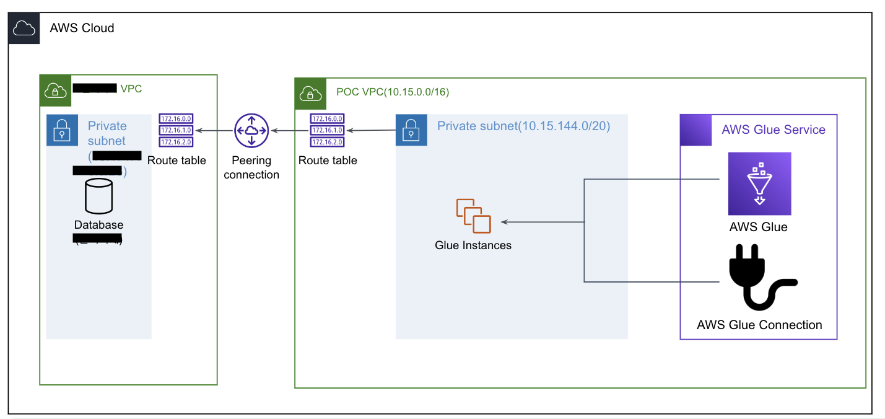

# 5. Glue

💡 [AWS Glue란?](https://www.notion.so/AWS-Glue-21a4e620cac84c54a1960d5f7d801697?pvs=21)

💡 `공통`
IAM Role : `DE-CF-GlueExecute-Role`
- SecretsManager Read/Write
- S3 Full Access
- Glue Service Role

AWS Glue 에서 Job, Crawler를 실행 시킬 때 필요한 Role 을 사전 생성.

## 5.1 Database 생성

- 이름 : {hist account id}-de-enhancement-db
    - 예 : blee-de-enhancement-db


## 5.2 [수행X] Glue Connection 생성(사전 생성 완료)



- AWS Glue connection 을 이용하여 Glue Job을 수행하는 인스턴스들을 어디에서 구동 시킬지 지정할 수 있음
    - Private SG 서로 네트워크 통하도록 처리 해야됨
- `미리 생성 해놓은 Connection 이용`
- Name : `DE-CF-GlueConnection`
- JDBC URL
    - jdbc:postgresql://{db_host}:{db_port}/{db_name}
    - db_host : RDS DNS or IP
    - db_port : Database Port
    - db_name : PostgreSQL databasename
- ID/PW
- VPC
    - RDS 설치된 VPC
    - Subnet : Private Subnet 선택


### [수행X, 사전 처리 완료] 보안그룹 Internal Network Connection

- Glue Job이 최소 2개의 인스턴스로 가동되어 데이터를 주고받는 통신을 수행하게 됨.
- 내부 끼리 통신이 가능해야 Glue 인스턴스끼리 Shuffle과 같은 Network IO를 수행할 수 있다
- 사전에 처리 되어있어 따로 수행할 필요는 없음.


## 5.3 T0, Dimension Data ELT


💡 Glue Job, Crawler 생성


### 5.3.1 Glue Job(Dimension)


💡 Dimension 성 테이블 : customer, products_info, zipcode 를 ETL 하는 Job
1개의 Job으로 3개 테이블 ELT 수행

RDS DB Table → S3 (parquet file)

`코드 변경`
→ Output Path


1. JobName : {hist_mail_id}_jb_de_enhancement_t0_dimension_d2s
    1. 예) blee_jb_de_dehancement_t0_dimension_d2s
2. Glue Version : `3.0`
3. Worker Type : `G 1X`
4. NumberOfWorkers : `2`
5. Script Path : 위에서 지정한 Glue ScriptPath
6. Maximum concurrency : 1
7. Temporary path : 위에서 지정한 Glue Temp Path 
8. Connections : **`5.1** 에서 생성한 Connection 선택`
9. Script 아래 내용 붙여 넣기
    - Script 내 수정 사항
        - `output_path` : 본인 S3 Data Bronze Path으로 변경
    - `Script`
        
        ```python
        import sys
        from awsglue.transforms import *
        from awsglue.utils import getResolvedOptions
        from pyspark.context import SparkContext
        from awsglue.context import GlueContext
        from awsglue.job import Job
        import json
        
        import boto3
        from botocore.exceptions import ClientError
        
        ## @params: [JOB_NAME]
        args = getResolvedOptions(sys.argv, ['JOB_NAME'])
        
        sc = SparkContext()
        glueContext = GlueContext(sc)
        spark = glueContext.spark_session
        
        hadoop_conf = glueContext._jsc.hadoopConfiguration()
        hadoop_conf.set("mapreduce.fileoutputcommitter.marksuccessfuljobs", "false")  # SUCCESS 폴더 생성 방지
        hadoop_conf.set("fs.s3.impl", "org.apache.hadoop.fs.s3a.S3AFileSystem")  # $folder$ 폴더  생성 방지 
        
        job = Job(glueContext)
        job.init(args['JOB_NAME'], args)
        
        def get_secret():
        
            secret_name = "de-enhancement-postgresql-secretsmanager"
            region_name = "ap-northeast-2"
        
            # Create a Secrets Manager client
            session = boto3.session.Session()
            client = session.client(
                service_name='secretsmanager',
                region_name=region_name
            )
        
            try:
                get_secret_value_response = client.get_secret_value(
                    SecretId=secret_name
                )
            except ClientError as e:
                # For a list of exceptions thrown, see
                # https://docs.aws.amazon.com/secretsmanager/latest/apireference/API_GetSecretValue.html
                return None
        
            # Decrypts secret using the associated KMS key.
            secret = get_secret_value_response['SecretString']
            return secret
        
        secret_json_str = get_secret()
        secret_json = json.loads(secret_json_str)
        
        db_host = secret_json['host']
        db_username = secret_json['username']
        db_password = secret_json['password']
        db_port = secret_json['port']
        
        db_url = f'jdbc:postgresql://{db_host}:{db_port}/postgres'
        
        db_schema = 'retail'
        
        dimension_table_list = ['customer', 'products_info', 'zipcode']
        
        for table_name in dimension_table_list:
            customer_df = spark.read.format("jdbc") \
                .option("url",db_url) \
                .option("dbtable",  f"{db_schema}.{table_name}") \
                .option("user",db_username) \
                .option("password",db_password) \
                .load()
            
            output_path = f's3://blee-lab/glue/data/dimension/{table_name}/'
            customer_df.write.mode('overwrite').parquet(output_path) # customer_df.write.mode('overwrite').partitionBy(['sex','age_group']).parquet(output_path)
        
        job.commit()
        ```
        
10. 결과물
    - `캡처`
        
        
        
        
        
        
        
        
        
        - S3 에서 직접 쿼리를 이용하여 데이터 확인이 가능
            
            
            
            
            
        

### 5.3.2 Crawler

S3에 적재 되어있는 데이터 (파일)을 Glue catalog 에 테이블로 생성하기 위한 작업.

Database의 Table처럼 메타 데이터를 관리 할 수 있도록 하는 Glue Catalog를 생성.

- 이름 : {hist_mail_id}_cr_de_enhancement_t0_dimension
    - blee_cr_de_enhancement_t0_dimension
- S3 Path : 본인이 생성한 S3 Bucket 내 Dimension Data 폴더 Path
    - s3://blee-lab/glue/data/dimension/
- IAM Role : 위에서 생성해놓은 IAM Role
- `실습`
    
    
    
    
    
    
    
    
    
    
    
    
    
    
    
    나머지는 Default로 진행 Next → Next → Create crawler
    
- 생성 이후 Run 수행
    - `결과`
        
        
        
        
        
        
        
        
        
        
        

## 5.4 [Glue Job] T0, Fact Data ELT


💡 구매 데이터 초기 적재
총 데이터 : 2,800백만 건

RDS DB Table → S3 (parquet file)

`코드 변경`
→ Output Path

### 5.4.1 Glue Job(Fact, Bronze)

1. JobName : {blee,mail_id}_jb_de_enhancement_t0_fact_d2s
2. Glue Version : 3.0
3. Worker Type : G 1X
4. NumberOfWorkers : 2
    - 데이터 수가 2,800백만 건이라 Worker 가 많이 필요하다. 라고 생각되지만 실제로 DB Connection이 일어날때는 따로 병렬처리 명령을 주지 않는다면 기본적으로 Single thread로 접근을 한다.
5. Script Path : 위에서 지정한 Glue ScriptPath
6. Maximum concurrency : 1
7. Temporary path : 위에서 지정한 Glue Temp Path 
8. Connections : **5.1** 에서 생성한 Connection 선택
9. Output
    1. Partition 지정 : 계열사, 구매년, 구매월
        1. `구매 일까지 나누게되면 데이터가 너무 적음` ⇒ 데이터 크기가 적으면 IO가 많이 일어나 속도가 저하됨.
        2. *구매일 + 2 Worker = 30분 넘게 소요.*
        3. 계열사, 구매년, 월 + Worker 2 + Partition 4 ⇒ 3분 40초
10. Script 아래 내용 붙여 넣기
    - `Script`
        
        ```python
        import sys
        from awsglue.transforms import *
        from awsglue.utils import getResolvedOptions
        from pyspark.context import SparkContext
        from awsglue.context import GlueContext
        from awsglue.job import Job
        from pyspark.sql.functions import col, substring
        
        import json
        import boto3
        from botocore.exceptions import ClientError
        
        ## @params: [JOB_NAME]
        args = getResolvedOptions(sys.argv, ['JOB_NAME'])
        
        sc = SparkContext()
        glueContext = GlueContext(sc)
        spark = glueContext.spark_session
        
        # --
        # -- Overwrite setting
        # --
        spark.conf.set("spark.sql.sources.partitionOverwriteMode","dynamic")  #  없으면 전체 Partition이 overwrite 된다 
        
        hadoop_conf = glueContext._jsc.hadoopConfiguration()
        hadoop_conf.set("mapreduce.fileoutputcommitter.marksuccessfuljobs", "false")  # SUCCESS 폴더 생성 방지
        hadoop_conf.set("fs.s3.impl", "org.apache.hadoop.fs.s3a.S3AFileSystem")  # $folder$ 폴더  생성 방지 
        
        job = Job(glueContext)
        job.init(args['JOB_NAME'], args)
        
        def get_secret():
        
            secret_name = "de-enhancement-postgresql-secretsmanager"
            region_name = "ap-northeast-2"
        
            # Create a Secrets Manager client
            session = boto3.session.Session()
            client = session.client(
                service_name='secretsmanager',
                region_name=region_name
            )
        
            try:
                get_secret_value_response = client.get_secret_value(
                    SecretId=secret_name
                )
            except ClientError as e:
                # For a list of exceptions thrown, see
                # https://docs.aws.amazon.com/secretsmanager/latest/apireference/API_GetSecretValue.html
                return None
        
            # Decrypts secret using the associated KMS key.
            secret = get_secret_value_response['SecretString']
            return secret
        
        secret_json_str = get_secret()
        secret_json = json.loads(secret_json_str)
        
        db_host = secret_json['host']
        db_username = secret_json['username']
        db_password = secret_json['password']
        db_port = secret_json['port']
        
        db_url = f'jdbc:postgresql://{db_host}:{db_port}/postgres'
        
        db_schema = 'retail'
        
        from_date = '20140101'
        to_date = '20141231'
        
        pushdownquery = f"""
        select * from {db_schema}.purchase
        where purchase_date between '{from_date}' and '{to_date}' 
        """
        
        purchase_df = spark.read.format("jdbc") \
            .option("url",db_url) \
            .option("query",  pushdownquery) \
            .option("user",db_username) \
            .option("password",db_password) \
            .load()
        
        # yyyymmdd -> year, month columns to seperate partitions
        purchase_rep_df = purchase_df.repartition(4)
        purchase_rep_df = purchase_rep_df.withColumn("purchase_year", substring(col("purchase_date"),1,4))
        purchase_rep_df = purchase_rep_df.withColumn("purchase_month", substring(col("purchase_date"),5,2))
        #purchase_df = purchase_df.withColumn("purchase_day", substring(col("purchase_date"),7,2))
            
        output_path = f's3://blee-lab/glue/data/fact/bronze/purchase/'
        purchase_rep_df.write.mode('overwrite').partitionBy(['affiliate','purchase_year', 'purchase_month']).parquet(output_path)
        
        job.commit()
        ```
        
11. 결과물
    - `캡처`
        
        
        
        
        
        
        
        
        
        - 파티션을 4개로 나눠서 작업을 수행했어서 결과물이 파일 4개로 떨어진다.
        
        
        
        
        

### 5.4.2 Crawler

S3에 적재 되어있는 데이터 (파일)을 Glue Catalog에 Table 로 생성하기 위한 작업.

Database의 Table처럼 메타 데이터를 관리 할 수 있도록 하는 Glue Catalog를 생성.

- 이름 : cr_de_enhancement_t0_fact
- S3 Path : 본인이 생성한 S3 Bucket 내 Fact Data 폴더명
    - s3://blee-lab/glue/data/fact/bronze/purchase/
- IAM Role : 위에서 생성해놓은 IAM Role
- 순서 : 5.3.1 과 동일하며, S3 Path 지정만 다르다.
- 생성 이후 Run 수행
    - `결과`
        
        
        
        
        
        
        
        